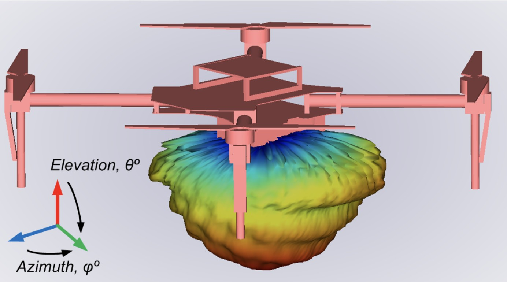
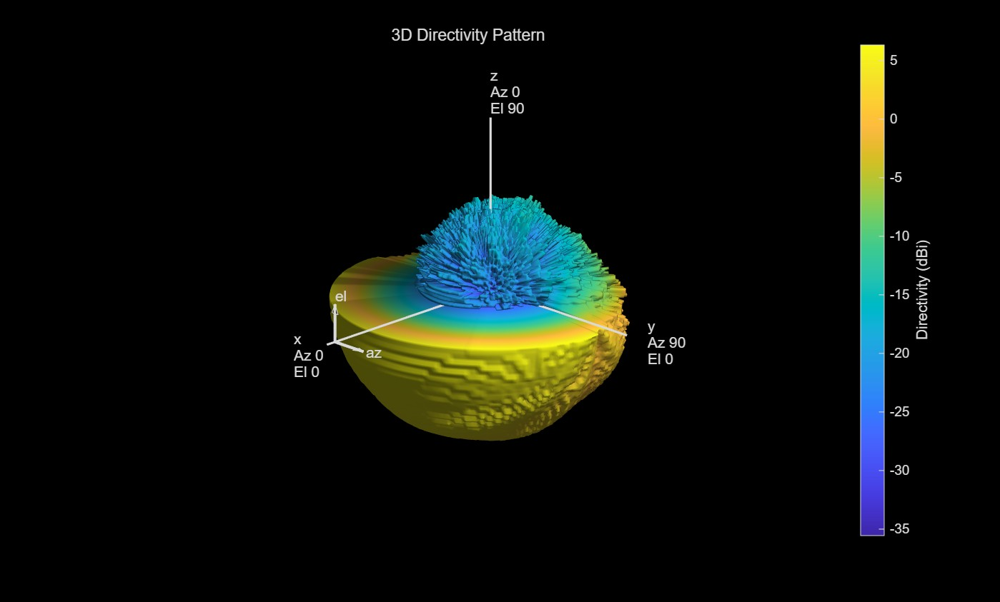
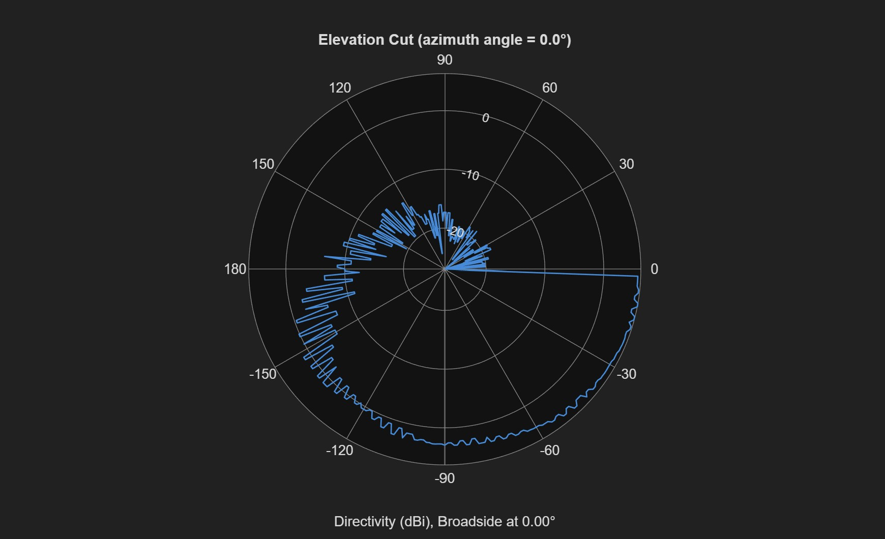

# UAV 28GHz 안테나 전기장 시뮬레이션

(Ref: W Xia,V. Semkin, M. Mezzavilla, G. Loianno, S. Rangan, Multi-array Designs for MmWave and   Sub-THzCommunication to UAVs, 2020)

1.안테나 전기장을 시뮬레이션한 데이터를 로드하고 수식을통해 Directivty값 구하기 
2.안테나 Directivity 3D & 2D 플롯팅 

# 결과

