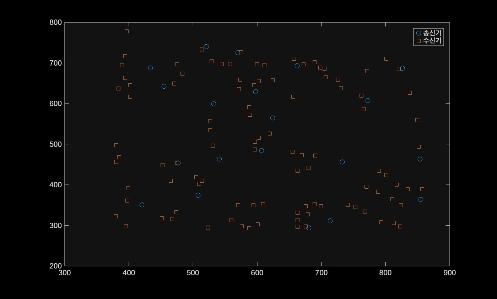
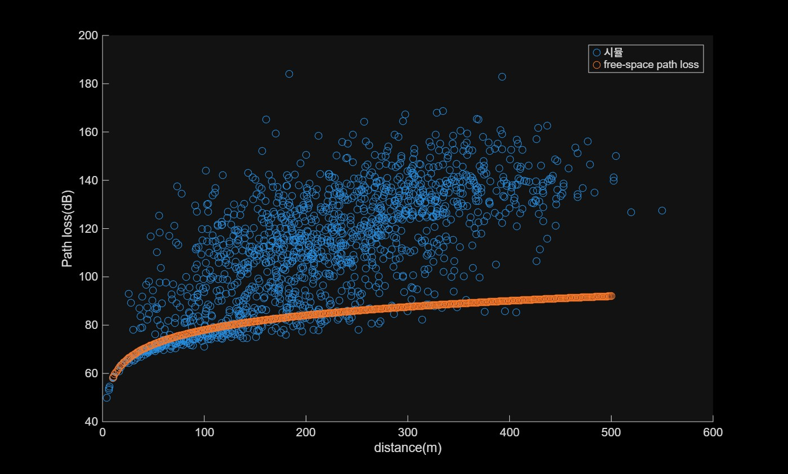
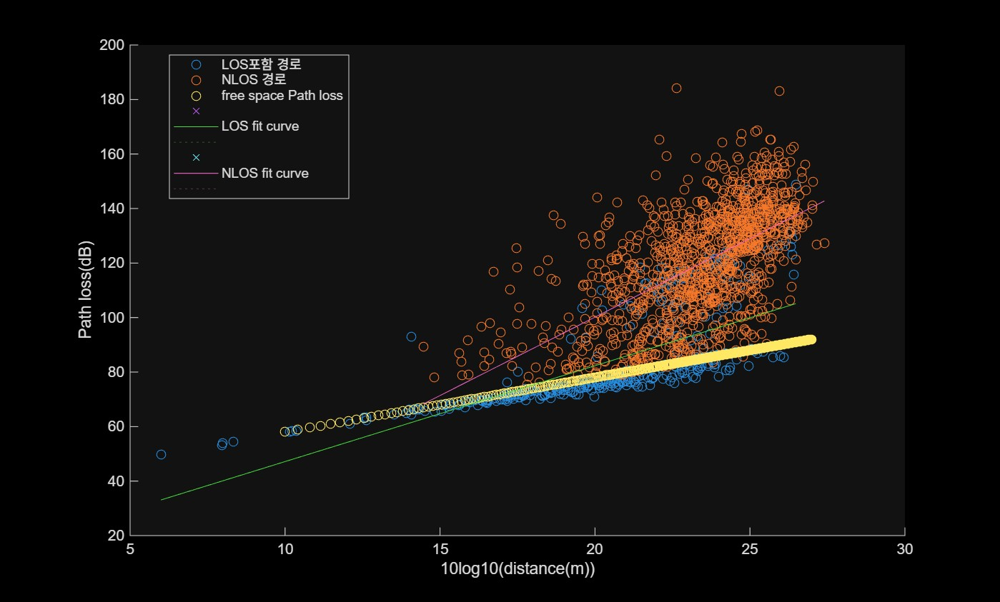

Lab2 : 전파모델실습, Ray tracing은 무선 적용범위를 예측하기 위한 3D 시뮬레이션  
  
코드흐름 :    
Ray tracing시뮬레이션된 결과를 불러오고 수신기와 송신기 사이의 path loss를 계산  
->시뮬레이션결과의 지연시간과 송수신기 거리를 비교하여 LOS or NLOS분류    
->LOS or NLOS 데이터에 선형회귀 모델 fitlm사용 ( 식 : a+10blog10(dist) )       
->링크상태를 예측하기위해 다항회귀모델 fitmnr사용 ->링크상태 예측  

Result1: 송&수신기 위치  
  

Result2: 시뮬래이션결과 & Free space pathloss  
  

Result3: LOS & NLOS경로 분류 후 선형회귀모델 학습  
  

Result4: 경로 분류를 다항회귀모델로 학습 후 예측
  
  
  
Lab2.m: 메인스크립트  
pathdata.m: 레이트레이싱 결과  
map.png: 시뮬레이션 환경
