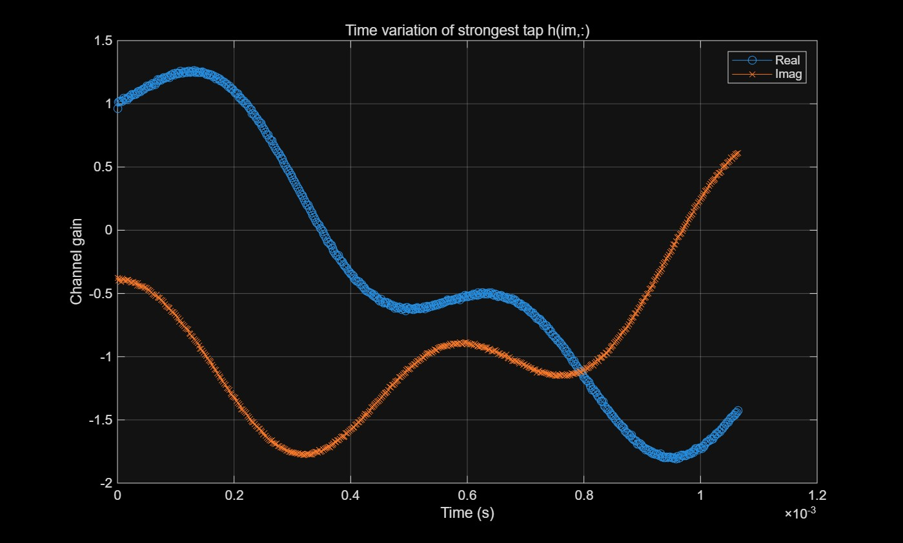
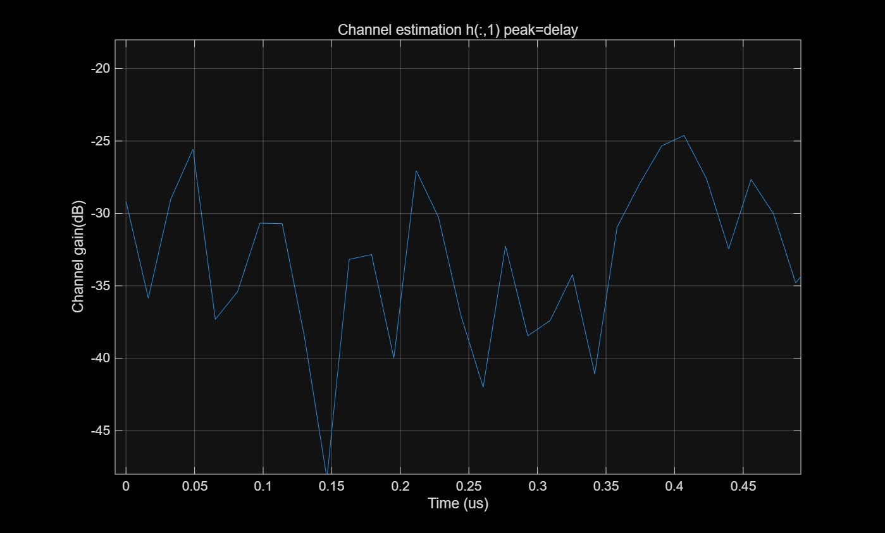
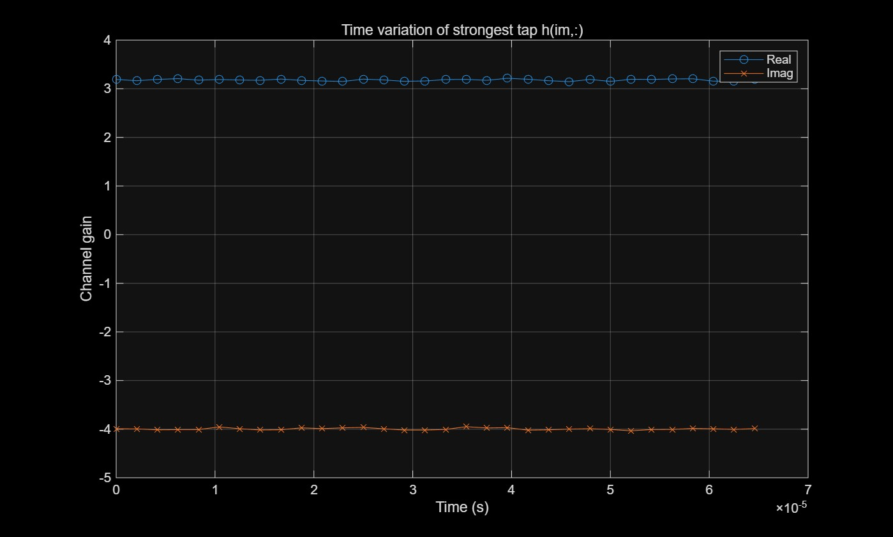

Lab3  
5G 다중경로채널을 클러스트 모델링 : 비슷한 지연경로를 하나의 클러스터로 묶는다.  

5G MATLAB toolbox 필요  
MATLAB이제공하는 5G Cluster Delay line 모델을 사용 (등방 안테나일때)

1. Cluster 모델의 채널지연과 Path gain플롯팅  
2. Patch antenna를 가정하여 가장강한경로로 안테나의 축을 돌리고 안테나의 directivity가 적용된 채널 Path gain플롯팅.  
3. 랜덤 주파수축 신호를 만들고 ifft + 멀티패스채널(딜레이,도플러) 적용 & Noise추가  
4. 주파수축 신호 단순 채널(시간축,주파수축)추정  
5. 추정된 채널에서 실제 딜레이 탭을 추정 하고 그 탭에서 채널변화(real,imag)를 확인함으로써 도플러에의한 페이딩(출렁출렁 채널) 효과를 확인  
6. SDR 실습

결과  
1.  

2.  

3.

4.

5.  

6.  

